  

## Hi, I'm Moustafa 👋

I'm a **backend engineer** who builds systems that stay correct when things go wrong — concurrent reservations, retries, partial failures, timeouts, and duplicate callbacks. I work primarily with **Laravel, PHP, and relational databases**, and I care more about explicit business rules and tests that prove behavior under failure than about happy-path demos.

- 🧱 **Domain-first Laravel** — services, actions, jobs, policies, form requests, and modular boundaries instead of fat controllers.
- 🔐 **Correctness under concurrency** — transactions, pessimistic locking, idempotency keys, and database constraints as the source of truth.
- 🧪 **Risk-based testing** — Pest/PHPUnit suites that deliberately repeat the hard paths (races, duplicates, out-of-order events).
- 🗄️ **Deliberate data modeling** — normalized schemas, projections, and query plans that hold up on MySQL.
- 🌐 **Full-stack when needed** — Livewire, Filament, Alpine, Tailwind, and the occasional React/TypeScript tool.

---

## 🚀 Featured Projects

### 🏭 [Warehouse Inventory Reservation Engine](https://github.com/Moustafa-Ahmed/warehouse-inventory-engine)
> An inventory core for a multi-warehouse ERP that preserves stock correctness under concurrent reservations, partial fulfillment, provider timeouts, and duplicate webhooks.

`Laravel 13` · `PHP 8.3` · `MySQL 8` · `Pest` · `Bootstrap/jQuery`

- **Concurrency-safe reservations** with pessimistic locking, stable operation keys, request-hash conflict detection, and database-level uniqueness.
- **Signed provider callbacks** — HMAC-SHA256 signatures, timestamp replay windows, durable webhook receipts, duplicate protection, out-of-order handling, and status reconciliation.
- **Real fulfillment lifecycle** — available → reserved → picked → packed → shipped, with partial reservations, releases, FIFO backorder recovery, reversals, and compensating actions.
- **Operational surface** — authenticated UI, reports, recovery commands, queue jobs, scheduler-based recovery, and deterministic demo scenarios.
- **Engineering docs** — architecture, business-rules handbook, decision register, acceptance scenarios, and test-evidence traceability.

[→ Repository](https://github.com/Moustafa-Ahmed/warehouse-inventory-engine) · [→ Architecture](https://github.com/Moustafa-Ahmed/warehouse-inventory-engine/blob/main/docs/ARCHITECTURE.md)

### 🎓 [Career 180 — LMS](https://github.com/Moustafa-Ahmed/lms)
> A mini learning-management system: courses, lessons, enrollment, and progress tracking with an admin panel.

`Laravel 12` · `Livewire 3` · `Filament v3` · `Alpine.js` · `Tailwind CSS v4` · `Pest`

- Role-based access with a Filament admin panel, media-backed lessons, queued welcome/completion email, and per-user timezones.
- Seeded demo data (admin + learner) and a documented data model with an ER diagram.

[→ Repository](https://github.com/Moustafa-Ahmed/lms)

### 🧭 [Business Flow Explorer](https://github.com/Moustafa-Ahmed/flow)
> Turns a product's business logic into a role-based mind map, then opens an interactive flowchart for each feature.

`React 19` · `TypeScript` · `React Flow` · `dagre` · `Vite`

- Schema-validated data contract (`project.schema.json`) with auto-layout graph rendering.
- Ships with an agent prompt that derives flows from a real codebase instead of inventing them.

[→ Repository](https://github.com/Moustafa-Ahmed/flow)

### 🗂️ [Agent Code Plan](https://github.com/Moustafa-Ahmed/Agent-Code-Plan)
> A drop-in project planning board (table + Kanban) that AI agents update through a single `tasks.json`.

`HTML` · `JSON Schema` · `Node.js`

- Full CRUD with inline editing, drag-and-drop Kanban, persisted UI preferences, and a schema-validated data file.

[→ Repository](https://github.com/Moustafa-Ahmed/Agent-Code-Plan)

---

## 🧰 Tech Stack

| Layer | Technologies |
| ----- | ------------ |
| **Languages** |    |
| **Backend** |       |
| **Databases** |   |
| **Frontend** |       |
| **Testing** |   |
| **Tooling** |    |

---

## 🧠 Engineering Highlights

The interesting part of backend work is rarely the feature — it's what happens when the network, the clock, or another request gets in the way. A few things I optimize for:

- **Correctness lives in the database.** Uniqueness constraints, check constraints, and transactions are the last line of defense; application code is the first.
- **Idempotency by design.** Every externally triggered operation has a stable key, so retries and duplicate callbacks converge instead of double-spending stock.
- **Make failure visible.** Timeouts are treated as *unknown* outcomes with explicit reconciliation, not as success or failure.
- **Test the risky paths on purpose.** Concurrency, duplicate-job, and out-of-order-callback tests run repeatedly rather than once.
- **Write down the decisions.** Non-obvious rules get a decision register so the *why* survives longer than the code.

---

## 📊 GitHub Activity

  

---

## 📫 Let's Connect

- **GitHub** — [@Moustafa-Ahmed](https://github.com/Moustafa-Ahmed)
- **Email** — [moustafa.ahmed.elfeky@gmail.com](mailto:moustafa.ahmed.elfeky@gmail.com)

I'm open to backend engineering roles and collaborations where correctness, clean architecture, and thoughtful testing matter. If a project catches your eye, open an issue or reach out — I'm happy to talk through the design decisions.
