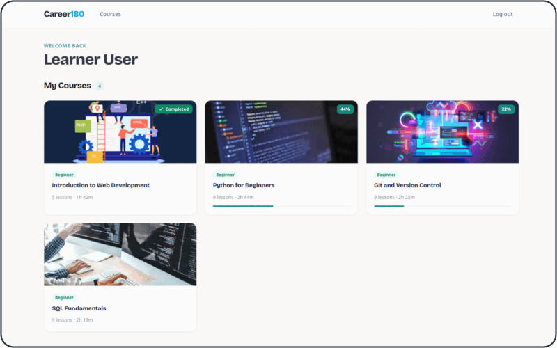
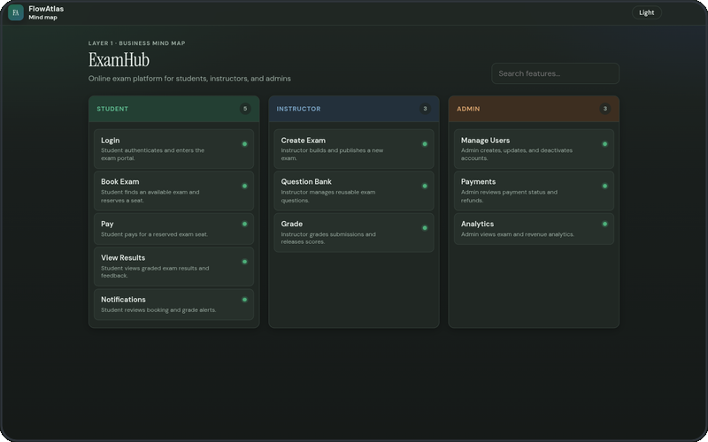
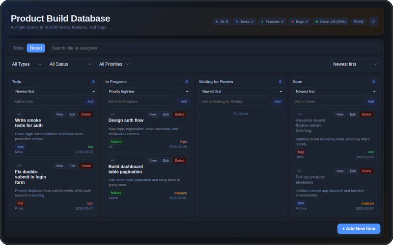

## Projects

<table>
  <tr>
    <td width="50%" valign="top">
       
      <a href="https://github.com/Moustafa-Ahmed/lms"><b>Career 180 LMS</b></a> 
      Courses, lessons, enrollment, and progress tracking, plus an admin panel. 
      <code>Laravel</code> <code>Livewire</code> <code>Filament</code>
    </td>
    <td width="50%" valign="top">
       
      <a href="https://github.com/Moustafa-Ahmed/flow"><b>Business Flow Explorer</b></a> 
      Draws a codebase's business logic as a role-based mind map, then a flowchart per feature. 
      <code>React</code> <code>TypeScript</code>
    </td>
  </tr>
  <tr>
    <td colspan="2" align="center" valign="top">
       
      <a href="https://github.com/Moustafa-Ahmed/Agent-Code-Plan"><b>Agent Code Plan</b></a> 
      A planning board you can drop into any project. Table and Kanban views from one JSON file. 
      <code>HTML</code> <code>JavaScript</code>
    </td>
  </tr>
</table>

## Contact

- GitHub: [@Moustafa-Ahmed](https://github.com/Moustafa-Ahmed)
- Email: [moustafa.ahmed.elfeky@gmail.com](mailto:moustafa.ahmed.elfeky@gmail.com)
